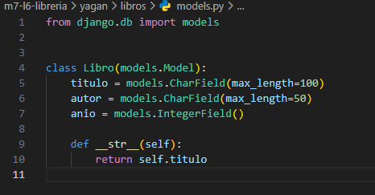
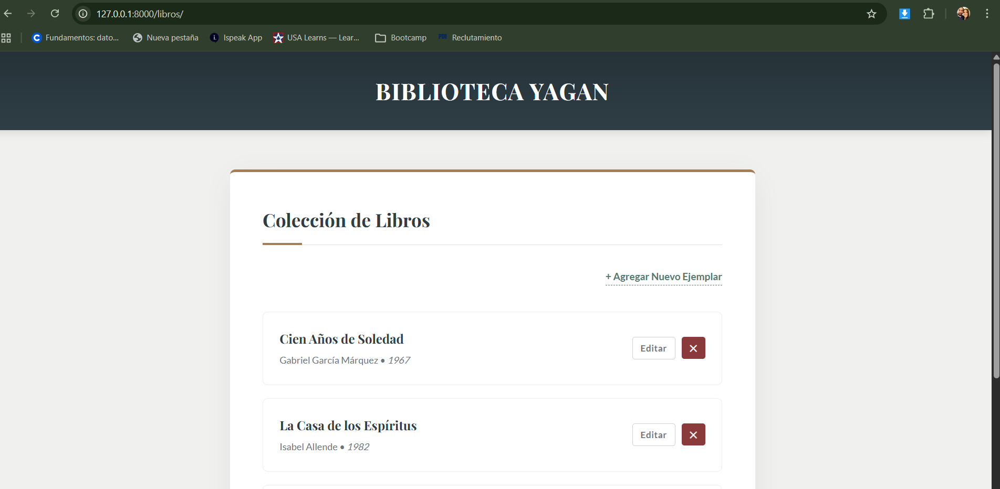
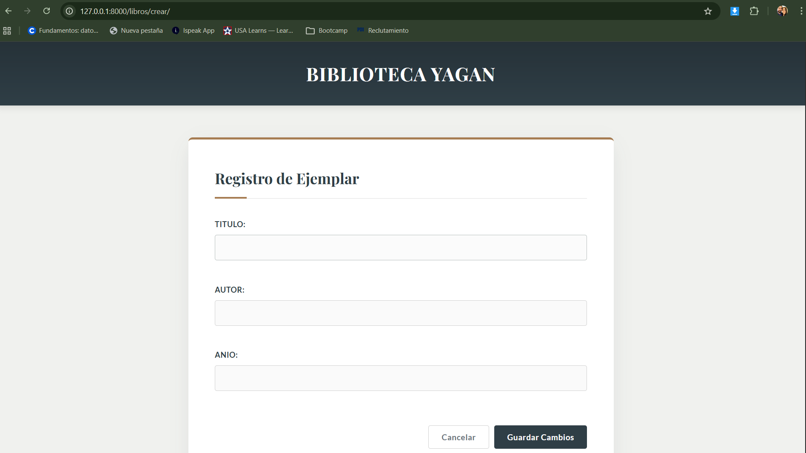
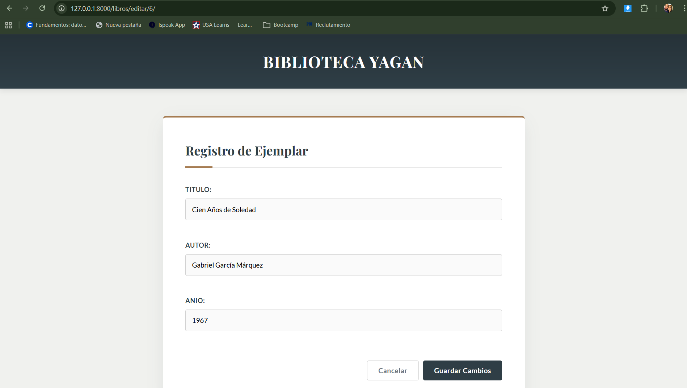
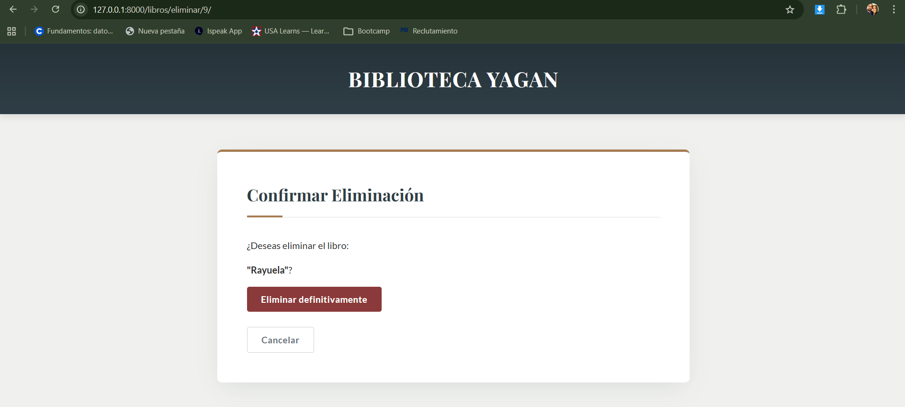
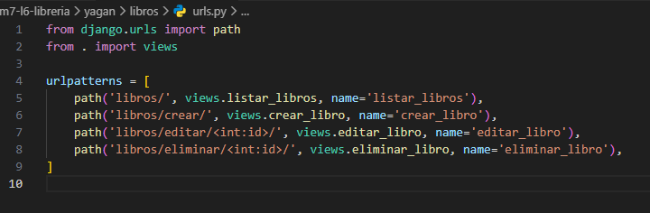
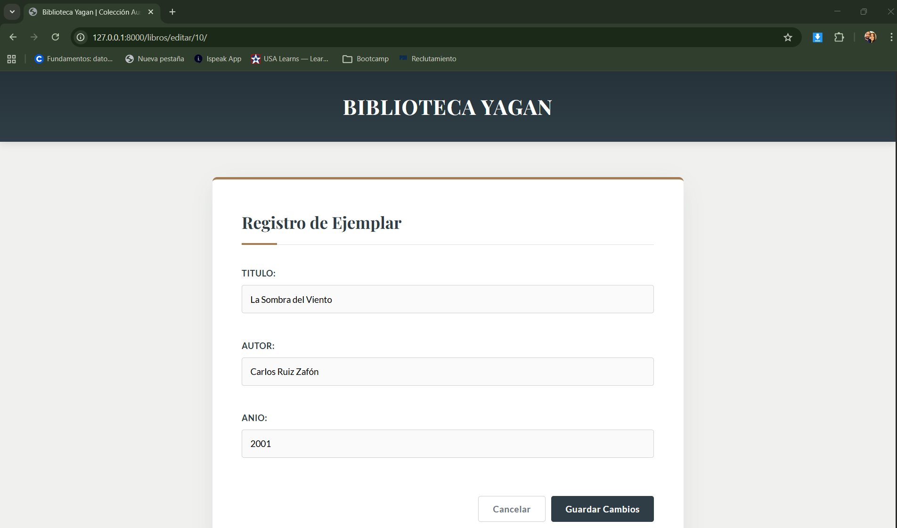

# 🌿 Biblioteca Yagan

### Módulo 7 — Actividad 6

**Implementación de CRUD con Django**

---

## 👩‍💻 Autoría

**Ximena Garrido**
Año 2026

Proyecto desarrollado como parte de la **Actividad 6 del Módulo 7**, cuyo objetivo es implementar un sistema CRUD funcional utilizando Django.

---

## 🎯 Objetivo de la Actividad

Desarrollar una aplicación web que permita gestionar libros mediante las cuatro operaciones fundamentales:

* Create (Crear)
* Read (Listar)
* Update (Editar)
* Delete (Eliminar)

Aplicando:

* Modelos en Django
* Migraciones
* Vistas CRUD
* URLs con parámetros dinámicos
* Templates con herencia
* Protección CSRF

---

# 🧱 Modelo Implementado

```python
class Libro(models.Model):
    titulo = models.CharField(max_length=100)
    autor = models.CharField(max_length=50)
    anio = models.IntegerField()
```



Este modelo permite almacenar la información básica de cada libro en la base de datos.

---

# 📚 Desarrollo de la Actividad

## • ¿Cómo funciona el flujo completo de una operación CRUD?

El flujo CRUD se desarrolla en cuatro etapas principales:

### 🔹 Create (Crear)

* Acceso a `/libros/crear/`
* Visualización de formulario
* Envío mediante POST
* Validación y guardado en base de datos
* Redirección al listado

### 🔹 Read (Listar)

* Acceso a `/libros/`
* Consulta con `Libro.objects.all()`
* Envío de datos al template
* Visualización de registros

### 🔹 Update (Editar)

* Acceso a `/libros/editar/<int:id>/`
* Obtención del libro con `get_object_or_404`
* Carga de datos en el formulario
* Guardado de cambios
* Redirección al listado

### 🔹 Delete (Eliminar)

* Acceso a `/libros/eliminar/<int:id>/`
* Vista de confirmación
* Eliminación mediante POST
* Redirección al listado

🔒 Todas las operaciones POST están protegidas con ``.

---

## • ¿Qué aprendiste sobre el enrutamiento y los parámetros dinámicos en URLs?

### 🔹 Enrutamiento

* Se define mediante `path()`.
* Permite asociar cada URL con una vista específica.
* Organiza la estructura de navegación del sistema.

### 🔹 Parámetros dinámicos

Ejemplo:

```python
path('libros/editar/<int:id>/', views.editar_libro, name='editar_libro')
```

* `<int:id>` captura el identificador desde la URL.
* Permite trabajar con un registro específico.
* Es fundamental para editar o eliminar datos concretos.

### 🔹 Uso de ``

* Genera enlaces dinámicos.
* Evita escribir rutas manualmente.
* Mejora la mantenibilidad del código.

---

# 📂 Estructura del Proyecto

```
m7-16-libreria/
│
├── yagan/
│   ├── manage.py
│   ├── libros/
│   │   ├── models.py
│   │   ├── views.py
│   │   ├── forms.py
│   │   ├── urls.py
│   │   ├── templates/
│   │   └── static/
│   └── yagan/
│       ├── settings.py
│       └── urls.py
│
└── README.md
```

---

# 📸 Evidencias de la Actividad

## 🔹 1. Listado de Libros



---

## 🔹 2. Formulario de Creación



---

## 🔹 3. Edición de Registro



---

## 🔹 4. Confirmación de Eliminación



---

## 🔹 5. Rutas con Parámetros Dinámicos




**Descripción:**
Se utiliza `<int:id>` en `urls.py` para capturar el identificador del libro desde la URL. Esto permite editar o eliminar un registro específico, como se observa en la ruta `/libros/editar/10/`, donde el número corresponde al ID del libro en la base de datos.

---

# 🏁 Conclusión

La Actividad 6 del Módulo 7 permitió implementar correctamente un sistema CRUD en Django, aplicando modelos, migraciones, vistas, rutas dinámicas, templates con herencia y protección CSRF, manteniendo una estructura clara y organizada.

---

# 🚀 Instalación y Ejecución del Proyecto

Sigue estos pasos para ejecutar el proyecto en tu entorno local:

## 1️⃣ Clonar el repositorio

```bash
git clone https://github.com/xgarridoig-jpg/m7-l6-libreria.git
cd m7-16-libreria
```

---

## 2️⃣ Crear y activar entorno virtual

```bash
python -m venv venv
```

En Windows:

```bash
venv\Scripts\activate
```

En macOS/Linux:

```bash
source venv/bin/activate
```

---

## 3️⃣ Instalar dependencias

```bash
pip install -r requirements.txt
```

---

## 4️⃣ Aplicar migraciones

```bash
python manage.py makemigrations
python manage.py migrate
```

---

## 5️⃣ Ejecutar el servidor

```bash
python manage.py runserver
```

Abrir en el navegador:

```
http://127.0.0.1:8000/libros/
```

---

**© 2026 — Biblioteca Yagan**
Desarrollado por **Ximena Garrido** 🌿

